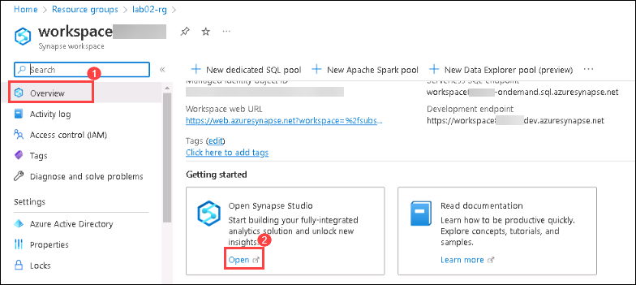
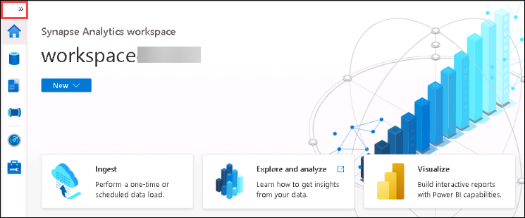
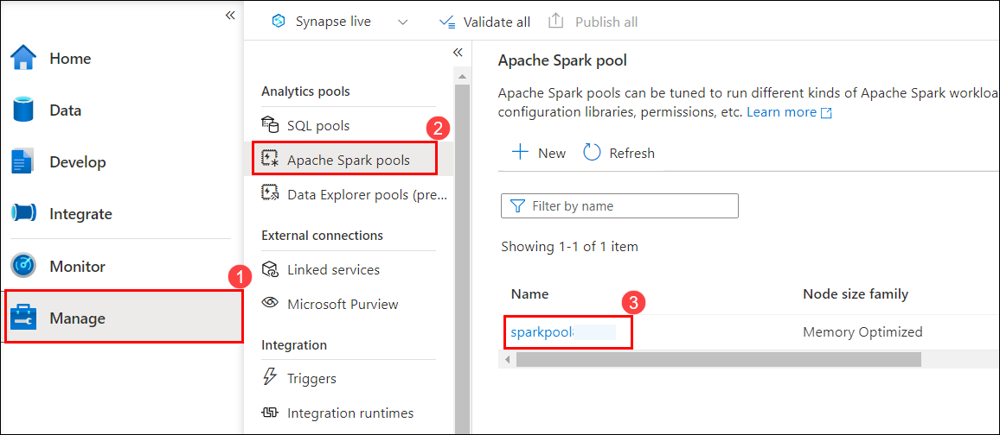
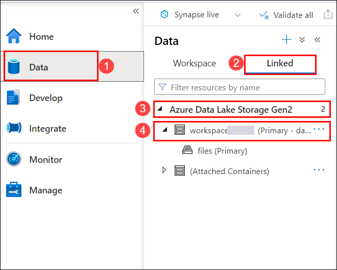
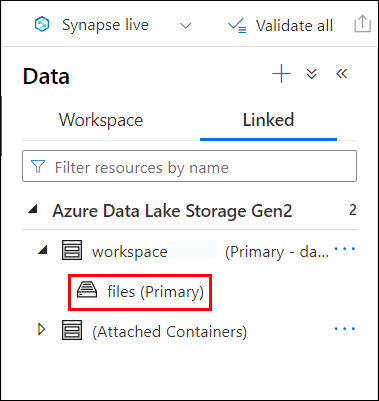
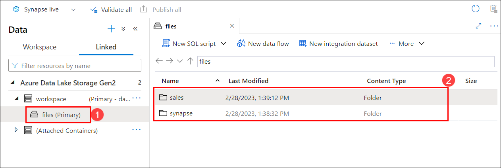
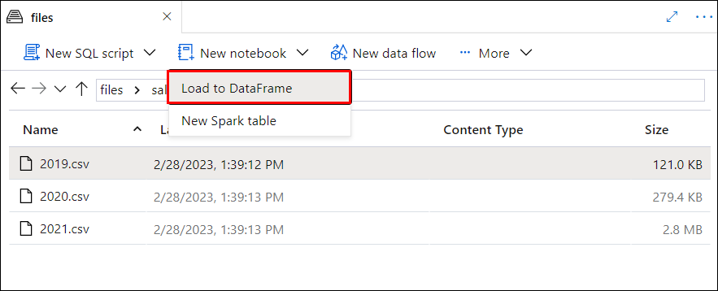
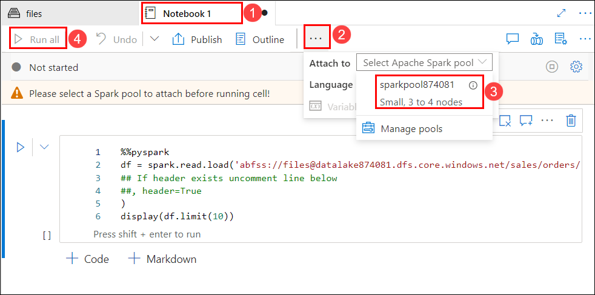
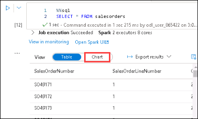

# Analyze data in a data lake with Spark

Apache Spark is an open source engine for distributed data processing, and is widely used to explore, process, and analyze huge volumes of data in data lake storage. Spark is available as a processing option in many data platform products, including Azure HDInsight, Azure Databricks, and Azure Synapse Analytics on the Microsoft Azure cloud platform. One of the benefits of Spark is support for a wide range of programming languages, including Java, Scala, Python, and SQL; making Spark a very flexible solution for data processing workloads including data cleansing and manipulation, statistical analysis and machine learning, and data analytics and visualization.

This lab will take approximately **45** minutes to complete.

## Provision an Azure Synapse Analytics workspace

You'll need an Azure Synapse Analytics workspace with access to data lake storage and an Apache Spark pool that you can use to query and process files in the data lake.

 >**Note**: Synapse Analytics workspace creation is done as a part of prerequisits.

Have a time to review the [Apache Spark in Azure Synapse Analytics](https://docs.microsoft.com/azure/synapse-analytics/spark/apache-spark-overview) article in the Azure Synapse Analytics documentation.

## Excercise 1: Query data in files

The script provisions an Azure Synapse Analytics workspace and an Azure Storage account to host the data lake, then uploads some data files to the data lake.

### Task 1: View files in the data lake

1.  If you are not logged in already, click on Azure portal shortcut that is available on the desktop and log in with below Azure credentials or skip to **step 2**.
    * Azure Username/Email: <inject key="AzureAdUserEmail"></inject> 
    * Azure Password: <inject key="AzureAdUserPassword"></inject>

1. Select the **Resource groups** under **Navigate**.

   
   
1. Under the Resource groups, select the **lab02-rg** name.

   
   
1. Now, serach for **synapse** and select the synapse workspace named **workspace<inject key="Deployment ID" enableCopy="false" />**.

   

1. In the **Overview** page for your Synapse workspace, in the **Open Synapse Studio** card, select **Open** to open Synapse Studio in a new browser tab. 

   >**Note**: Signin in if prompted.

    

1. On the left side of Synapse Studio, use the **&rsaquo;&rsaquo;** icon to expand the menu - this reveals the different pages within Synapse Studio that you'll use to manage resources and perform data analytics tasks.

   

1. On the **Manage (1)** page, select the **Apache Spark pools (2)** tab and note that a Spark pool with a name similar to **sparkpool<inject key="Deployment ID" enableCopy="false" /> (3)** has been provisioned in the workspace. Later you will use this Spark pool to load and analyze data from files in the data lake storage for the workspace.

   

1. On the **Data (1)** page, view the **Linked (2)** tab and verify that your workspace includes a link to your **Azure Data Lake Storage Gen2 (3)** storage account, which should have a name similar to **workspace<inject key="Deployment ID" enableCopy="false" /> (Primary - datalake*xxxxxxx*) (4)**.

   

1. Expand your storage account and verify that it contains a file system container named **files**.

   

1. Select the **files (1)** container, and note that it contains folders named **sales** and **synapse** (2). The **synapse** folder is used by Azure Synapse, and the **sales** folder contains the data files you are going to query.

   

1. Double click on the **sales** folder to open and the **orders** folder it contains, and observe that the **orders** folder contains **.csv** files for three years of sales data.

   

1. Right-click any of the files and select **Preview** to see the data it contains. Note that the files do not contain a header row, so you can unselect the option to display column headers.

### Task 2: Use Spark to explore data

1. Select any of the files in the **orders** folder, and then in the **New notebook** list on the toolbar, select **Load to DataFrame**. A dataframe is a structure in Spark that represents a tabular dataset.

   

1. In the new **Notebook 1 (1)** tab that opens, Select the **... (2)** icon to open the **Attach to** list, select your Spark pool  **sparkpool<inject key="Deployment ID" enableCopy="false" /> (3)**. Then use the **&#9655; Run all (4)** button to run all of the cells in the notebook (there's currently only one!).
 
   

    >**Note**: Since this is the first time you've run any Spark code in this session, the Spark pool must be started. This means that the first run in the session can     take a few minutes. Subsequent runs will be quicker.
  
1. While you are waiting for the Spark session to initialize, review the code that was generated; which looks similar to this:

    ```Python
    %%pyspark
    df = spark.read.load('abfss://files@datalakexxxxxxx.dfs.core.windows.net/sales/orders/2019.csv', format='csv'
    ## If header exists uncomment line below
    ##, header=True
    )
    display(df.limit(10))
    ```

1. When the code has finished running, review the output beneath the cell in the notebook. It shows the first ten rows in the file you selected, with automatic column names in the form **_c0**, **_c1**, **_c2**, and so on.

1. Modify the code so that the **spark.read.load** function reads data from <u>all</u> of the CSV files in the folder, and the **display** function shows the first 100 rows. Your code should look like this (with *datalakexxxxxxx* matching the name of your data lake store):

    ```Python
    %%pyspark
    df = spark.read.load('abfss://files@datalakexxxxxxx.dfs.core.windows.net/sales/orders/*.csv', format='csv'
    )
    display(df.limit(100))
    ```

1. Use the **&#9655;** button to the left of the code cell to run just that cell, and review the results.

   The dataframe now includes data from all of the files, but the column names are not useful. Spark uses a "schema-on-read" approach to try to determine appropriate      data types for the columns based on the data they contain, and if a header row is present in a text file it can be used to identify the column names (by specifying    a **header=True** parameter in the **load** function). Alternatively, you can define an explicit schema for the dataframe.

1. Modify the code as follows (replacing *datalakexxxxxxx*), to define an explicit schema for the dataframe that includes the column names and data types. Rerun the code in the cell.

    ```Python
    %%pyspark
    from pyspark.sql.types import *
    from pyspark.sql.functions import *

    orderSchema = StructType([
        StructField("SalesOrderNumber", StringType()),
        StructField("SalesOrderLineNumber", IntegerType()),
        StructField("OrderDate", DateType()),
        StructField("CustomerName", StringType()),
        StructField("Email", StringType()),
        StructField("Item", StringType()),
        StructField("Quantity", IntegerType()),
        StructField("UnitPrice", FloatType()),
        StructField("Tax", FloatType())
        ])

    df = spark.read.load('abfss://files@datalakexxxxxxx.dfs.core.windows.net/sales/orders/*.csv', format='csv', schema=orderSchema)
    display(df.limit(100))
    ```

1. Under the results, use the **+ Code** button to add a new code cell to the notebook. Then in the new cell, add the following code to display the dataframe's schema:

    ```Python
    df.printSchema()
    ```
    
   

1. Run the new cell and verify that the dataframe schema matches the **orderSchema** you defined. The **printSchema** function can be useful when using a dataframe with an automatically inferred schema.

## Excercise 2: Analyze data in a dataframe

The **dataframe** object in Spark is similar to a Pandas dataframe in Python, and includes a wide range of functions that you can use to manipulate, filter, group, and otherwise analyze the data it contains.

### Task 1: Filter a dataframe

1. Add a new code cell to the notebook, and enter the following code in it:

    ```Python
    customers = df['CustomerName', 'Email']
    print(customers.count())
    print(customers.distinct().count())
    display(customers.distinct())
    ```
   

1. Run the new code cell, and review the results. Observe the following details:
    - When you perform an operation on a dataframe, the result is a new dataframe (in this case, a new **customers** dataframe is created by selecting a specific subset of columns from the **df** dataframe)
    - Dataframes provide functions such as **count** and **distinct** that can be used to summarize and filter the data they contain.
    - The `dataframe['Field1', 'Field2', ...]` syntax is a shorthand way of defining a subset of column. You can also use **select** method, so the first line of the code above could be written as `customers = df.select("CustomerName", "Email")`

1. Modify the code as follows:

    ```Python
    customers = df.select("CustomerName", "Email").where(df['Item']=='Road-250 Red, 52')
    print(customers.count())
    print(customers.distinct().count())
    display(customers.distinct())
    ```

1. Run the modified code to view the customers who have purchased the *Road-250 Red, 52* product. Note that you can "chain" multiple functions together so that the output of one function becomes the input for the next - in this case, the dataframe created by the **select** method is the source dataframe for the **where** method that is used to apply filtering criteria.

### Task 2: Aggregate and group data in a dataframe

1. Add a new code cell to the notebook, and enter the following code in it:

    ```Python
    productSales = df.select("Item", "Quantity").groupBy("Item").sum()
    display(productSales)
    ```

1. Run the code cell you added, and note that the results show the sum of order quantities grouped by product. The **groupBy** method groups the rows by *Item*, and the subsequent **sum** aggregate function is applied to all of the remaining numeric columns (in this case, *Quantity*)

1. Add another new code cell to the notebook, and enter the following code in it:

    ```Python
    yearlySales = df.select(year("OrderDate").alias("Year")).groupBy("Year").count().orderBy("Year")
    display(yearlySales)
    ```

1. Run the code cell you added, and note that the results show the number of sales orders per year. Note that the **select** method includes a SQL **year** function to extract the year component of the *OrderDate* field, and then an **alias** method is used to assign a columm name to the extracted year value. The data is then grouped by the derived *Year* column and the count of rows in each group is calculated before finally the **orderBy** method is used to sort the resulting dataframe.

## Excercise 3: Query data using Spark SQL

As you've seen, the native methods of the dataframe object enable you to query and analyze data quite effectively. However, many data analysts are more comfortable working with SQL syntax. Spark SQL is a SQL language API in Spark that you can use to run SQL statements, or even persist data in relational tables.

### Task 1: Use Spark SQL in PySpark code

The default language in Azure Synapse Studio notebooks is PySpark, which is a Spark-based Python runtime. Within this runtime, you can use the **spark.sql** library to embed Spark SQL syntax within your Python code, and work with SQL constructs such as tables and views.

1. Add a new code cell to the notebook, and enter the following code in it:

    ```Python
    df.createOrReplaceTempView("salesorders")

    spark_df = spark.sql("SELECT * FROM salesorders")
    display(spark_df)
    ```

1. Run the cell and review the results. Observe that:
    - The code persists the data in the **df** dataframe as a temporary view named **salesorders**. Spark SQL supports the use of temporary views or persisted tables as sources for SQL queries.
    - The **spark.sql** method is then used to run a SQL query against the **salesorders** view.
    - The results of the query are stored in a dataframe.

### Task 2: Run SQL code in a cell

While it's useful to be able to embed SQL statements into a cell containing PySpark code, data analysts often just want to work directly in SQL.

1. Add a new code cell to the notebook, and enter the following code in it:

    ```sql
    %%sql
    SELECT YEAR(OrderDate) AS OrderYear,
           SUM((UnitPrice * Quantity) + Tax) AS GrossRevenue
    FROM salesorders
    GROUP BY YEAR(OrderDate)
    ORDER BY OrderYear;
    ```

1. Run the cell and review the results. Observe that:
    - The `%%sql` line at the beginning of the cell (called a *magic*) indicates that the Spark SQL language runtime should be used to run the code in this cell instead of PySpark.
    - The SQL code references the **salesorder** view that you created previously using PySpark.
    - The output from the SQL query is automatically displayed as the result under the cell.

> **Note**: For more information about Spark SQL and dataframes, see the [Spark SQL documentation](https://spark.apache.org/docs/2.2.0/sql-programming-guide.html).

## Excercise 4: Visualize data with Spark

A picture is proverbially worth a thousand words, and a chart is often better than a thousand rows of data. While notebooks in Azure Synapse Analytics include a built in chart view for data that is displayed from a dataframe or Spark SQL query, it is not designed for comprehensive charting. However, you can use Python graphics libraries like **matplotlib** and **seaborn** to create charts from data in dataframes.

### Task 1: View results as a chart

1. Add a new code cell to the notebook, and enter the following code in it:

    ```sql
    %%sql
    SELECT * FROM salesorders
    ```

1. Run the code and observe that it returns the data from the **salesorders** view you created previously.

1. In the results section beneath the cell, change the **View** option from **Table** to **Chart**.

   

1. Use the **View options** button at the top right of the chart to display the options pane for the chart. Then set the options as follows and select **Apply**:
    - **Chart type**: Bar chart
    - **Key**: Item
    - **Values**: Quantity
    - **Series Group**: *leave blank*
    - **Aggregation**: Sum
    - **Stacked**: *Unselected*

1. Verify that the chart looks similar to this:

    

### Task 2: Get started with **matplotlib**

1. Add a new code cell to the notebook, and enter the following code in it:

    ```Python
    sqlQuery = "SELECT CAST(YEAR(OrderDate) AS CHAR(4)) AS OrderYear, \
                    SUM((UnitPrice * Quantity) + Tax) AS GrossRevenue \
                FROM salesorders \
                GROUP BY CAST(YEAR(OrderDate) AS CHAR(4)) \
                ORDER BY OrderYear"
    df_spark = spark.sql(sqlQuery)
    df_spark.show()
    ```

1. Run the code and observe that it returns a Spark dataframe containing the yearly revenue.

    To visualize the data as a chart, we'll start by using the **matplotlib** Python library. This library is the core plotting library on which many others are based, and provides a great deal of flexibility in creating charts.

1. Add a new code cell to the notebook, and add the following code to it:

    ```Python
    from matplotlib import pyplot as plt

    # matplotlib requires a Pandas dataframe, not a Spark one
    df_sales = df_spark.toPandas()

    # Create a bar plot of revenue by year
    plt.bar(x=df_sales['OrderYear'], height=df_sales['GrossRevenue'])

    # Display the plot
    plt.show()
    ```

1. Run the cell and review the results, which consist of a column chart with the total gross revenue for each year. Note the following features of the code used to produce this chart:
    - The **matplotlib** library requires a *Pandas* dataframe, so you need to convert the *Spark* dataframe returned by the Spark SQL query to this format.
    - At the core of the **matplotlib** library is the **pyplot** object. This is the foundation for most plotting functionality.
    - The default settings result in a usable chart, but there's considerable scope to customize it

1. Modify the code to plot the chart as follows:

    ```Python
    # Clear the plot area
    plt.clf()

    # Create a bar plot of revenue by year
    plt.bar(x=df_sales['OrderYear'], height=df_sales['GrossRevenue'], color='orange')

    # Customize the chart
    plt.title('Revenue by Year')
    plt.xlabel('Year')
    plt.ylabel('Revenue')
    plt.grid(color='#95a5a6', linestyle='--', linewidth=2, axis='y', alpha=0.7)
    plt.xticks(rotation=45)

    # Show the figure
    plt.show()
    ```

1. Re-run the code cell and view the results. The chart now includes a little more information.

    A plot is technically contained with a **Figure**. In the previous examples, the figure was created implicitly for you; but you can create it explicitly.

1. Modify the code to plot the chart as follows:

    ```Python
    # Clear the plot area
    plt.clf()

    # Create a Figure
    fig = plt.figure(figsize=(8,3))

    # Create a bar plot of revenue by year
    plt.bar(x=df_sales['OrderYear'], height=df_sales['GrossRevenue'], color='orange')

    # Customize the chart
    plt.title('Revenue by Year')
    plt.xlabel('Year')
    plt.ylabel('Revenue')
    plt.grid(color='#95a5a6', linestyle='--', linewidth=2, axis='y', alpha=0.7)
    plt.xticks(rotation=45)

    # Show the figure
    plt.show()
    ```

1. Re-run the code cell and view the results. The figure determines the shape and size of the plot.

    A figure can contain multiple subplots, each on its own *axis*.

1. Modify the code to plot the chart as follows:

    ```Python
    # Clear the plot area
    plt.clf()

    # Create a figure for 2 subplots (1 row, 2 columns)
    fig, ax = plt.subplots(1, 2, figsize = (10,4))

    # Create a bar plot of revenue by year on the first axis
    ax[0].bar(x=df_sales['OrderYear'], height=df_sales['GrossRevenue'], color='orange')
    ax[0].set_title('Revenue by Year')

    # Create a pie chart of yearly order counts on the second axis
    yearly_counts = df_sales['OrderYear'].value_counts()
    ax[1].pie(yearly_counts)
    ax[1].set_title('Orders per Year')
    ax[1].legend(yearly_counts.keys().tolist())

    # Add a title to the Figure
    fig.suptitle('Sales Data')

    # Show the figure
    plt.show()
    ```

1. Re-run the code cell and view the results. The figure contains the subplots specified in the code.

>**Note**: To learn more about plotting with matplotlib, see the [matplotlib documentation](https://matplotlib.org/).

### Task 3: Use the **seaborn** library

While **matplotlib** enables you to create complex charts of multiple types, it can require some complex code to achieve the best results. For this reason, over the years, many new libraries have been built on the base of matplotlib to abstract its complexity and enhance its capabilities. One such library is **seaborn**.

1. Add a new code cell to the notebook, and enter the following code in it:

    ```Python
    import seaborn as sns

    # Clear the plot area
    plt.clf()

    # Create a bar chart
    ax = sns.barplot(x="OrderYear", y="GrossRevenue", data=df_sales)
    plt.show()
    ```

1. Run the code and observe that it displays a bar chart using the seaborn library.

1. Add a new code cell to the notebook, and enter the following code in it:

    ```Python
    # Clear the plot area
    plt.clf()

    # Set the visual theme for seaborn
    sns.set_theme(style="whitegrid")

    # Create a bar chart
    ax = sns.barplot(x="OrderYear", y="GrossRevenue", data=df_sales)
    plt.show()
    ```

1. Run the code and note that seaborn enables you to set a consistent color theme for your plots.

1. Add a new code cell to the notebook, and enter the following code in it:

    ```Python
    # Clear the plot area
    plt.clf()

    # Create a bar chart
    ax = sns.lineplot(x="OrderYear", y="GrossRevenue", data=df_sales)
    plt.show()
    ```

1. Run the code to view the yearly revenue as a line chart.

>**Note**: To learn more about plotting with seaborn, see the [seaborn documentation](https://seaborn.pydata.org/index.html).


**End of the Lab**
