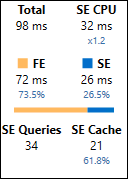
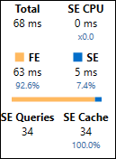

# Use tools to optimize Power BI performance

## Overview

**The estimated time to complete the lab is 30 minutes**

In this lab, you will learn how to use two external tools to help you develop, manage, and optimize data models and DAX queries.

In this lab, you learn how to:

- Use Best Practice Analyzer (BPA).

- Use DAX Studio.

## Excercise-1: Use Best Practice Analyzer

In this exercise,You will review the BPA rules, and then address specific issues found in the data model.

>**Note**: BPA is a free third-party tool that notifies you of potential modeling missteps or changes that you can make to improve your model design and performance. It includes recommendations for naming, user experience, and common optimizations that you can apply to improve performance. For more information, see [Best practice rules to improve your model's performance](https://powerbi.microsoft.com/blog/best-practice-rules-to-improve-your-models-performance/).


### Task-1: Set up Power BI Desktop

In this task, you will open a pre-developed Power BI Desktop solution.

1. In File Explorer, go to the **C:\LabFiles\DP-500-Azure-Data-Analyst\Allfiles\13\Starter** folder.

2. To open a pre-developed Power BI Desktop file, double-click the **Sales Analysis - Use tools to optimize Power BI performance.pbix** file.

3. To save the file, on the **File** ribbon tab, select **Save as**.

4. In the **Save As** window, go to the **C:\LabFiles\DP-500-Azure-Data-Analyst\Allfiles\13\MySolution** folder.

5. Select **Save**.

6.  Select the **External Tools** ribbon tab.

    .png)

7.  Notice that it’s possible to launch Tabular Editor from this ribbon tab.

    

    >**Note**: Later in this exercise, you will use Tabular Editor to work with BPA.

### Task-2: Review the data model

In this task, you will review the data model.

1. In Power BI Desktop, at the left, switch to **Model** view.
    
    

2. Use the model diagram to review the model design.

    .png)

    >**Note**: The model comprises eight dimension tables and one fact table. The **Sales** fact table stores sales order details. It's a classic star schema design that includes snowflake dimension tables (**Category** > **Subcategory** > **Product**) for the product dimension.

    >**Note**: In this exercise, you will use BPA to detect model issues and fix them.

### Task-3: Load BPA rules

In this task, you will load BPA rules.

>**Note**: The BPA rules aren't added during the Tabular Editor installation. You must download and install them.

1. Navigate back to power bi desktop and on the **External Tools** ribbon, select **Tabular Editor**.

    

    >**Note**: Tabular Editor opens in a new window and connects live to the data model hosted in Power BI Desktop. Changes made to the model in Tabular Editor aren't propagated to Power BI Desktop until you save them.

2. To load the BPA rules, select the **C# Script** tab.

   >**Note**: This may be called the Advanced Scripting tab in older versions of Tabular Editor.

   .png)

3. Paste in the following script.

   >**Tip**: The script is available to copy and paste from the **C:\LabFiles\DP-500-Azure-Data-Analyst\Allfiles\13\Assets\Snippets.txt**.

	```
	System.Net.WebClient w = new System.Net.WebClient(); 

	string path = System.Environment.GetFolderPath(System.Environment.SpecialFolder.LocalApplicationData);
	string url = "https://raw.githubusercontent.com/microsoft/Analysis-Services/master/BestPracticeRules/BPARules.json";
	string downloadLoc = path+@"\TabularEditor\BPARules.json";
	w.DownloadFile(url, downloadLoc);
	```

4. To run the script, on the toolbar, select the **Run script** command.

    .png)

    >**Note**: To use the BPA rules, you must close and then reopen Tabular Editor.

5. Close Tabular Editor.

6. To reopen Tabular Editor, in Power BI Desktop, on the **External Tools** ribbon, select **Tabular Editor**.

    

### Task-4: Review the BPA rules

In this task, you will review the BPA rules that you loaded in the previous task.

1. In Tabular Editor, on the menu, select **Tools** > **Manage BPA Rules**.

    .png)
	
2. In the **Manage Best Practice Rules** window, in the **Rule collections** list, select **Rules for the local user**.

    .png)
	
3. In the **Rules in collection** list, scroll down the list of rules.

   >**Tip**: You can drag the bottom right corner to enlarge the window.

   >**Note**: Within seconds, Tabular Editor can scan your entire model against each of the rules and provides a report of all the model objects which satisfy the condition in each rule.

4. Notice that BPA groups the rules into categories.

   >**Note**: Some rules, like DAX expressions, focus on performance optimization while others, like the formatting rules, are aesthetic-oriented.*

5. Notice the **Severity** column.

   >**Note**: The higher the number, the more important the rule.

6. Scroll to the bottom of the list, and then uncheck the **Set IsAvailableInMdx to false on non-attribute columns** rule,if it was checked and select **OK**.

	.png)

    >**Note**: You can disable individual rules or entire categories of rules. BPA won't check disabled rules against your model. The removal of this specific rule is to show you how to disable a rule.

### Task-5 Address BPA issues

In this task, you will open BPA and review the results of the checks.

1. On the menu, select **Tools** > **Best Practice Analyzer** (or press **F10**).

	.png)

2. In the **Best Practice Analyzer** window, if necessary, maximize the window.

3. Notice the list of (possible) issues, grouped by category.

4. In the first category, right-click the **'Product'** table, and then select **Ignore item**.

    .png)

    >**Note**: When an issue isn't really an issue, you can ignore that item. You can always reveal ignored items by using the **Show ignored** command on the toolbar.

5. Further down the list, in the **Use the DIVIDE function for division** category, right-click **[Profit Margin]**, and then select **Go to object**.

     .png)

     >**Note**: This command switches to Tabular Editor and focuses on the object. It makes it easy to apply a fix to the issue.

6. In the Expression Editor, modify the DAX formula to use the more efficient (and safe) [DIVIDE](https://docs.microsoft.com/dax/divide-function-dax) function, as follows.

	>**Tip**: All formulas are available to copy and paste from the **C:\LabFiles\DP-500-Azure-Data-Analyst\Allfiles\13\Assets\Snippets.txt**.

	```
	DIVIDE ( [Profit], SUM ( 'Sales'[Sales Amount] ) )C#
	```


    .png)
    
    
7. To save the model changes, on the toolbar, select the **Save changes to the connected database** command (or press **Ctrl+S**).

    .png)

    >**Note**: Saving changes pushes modifications to the Power BI Desktop data model.

8. Switch back to the (out of focus) **Best Practice Analyzer** window.

9. Notice that BPA no longer lists the issue.

10. Scroll down the list of issues to locate the **Provide format string for "Date" columns** category.

     

11. Right-click the **'Date'[Date]** issue, and then select **Generate fix script**.

     .png)

      >**Note**: This command generates a C# script and copies it to the clipboard. You can also use the **Apply fix** command to generate and run the script, however it might be safer to review (and modify) the script before you run it.

12. When notified that BPA has copied the fix script to the clipboard, select **OK**.

13. Switch to Tabular Editor, and select the **C# Script** tab.

    >**Note**: This may be called the Advanced Scripting tab in older versions of Tabular editor.
	
    .png)

14. To paste the fix script, right-click inside the pane, and then press **Ctrl+V**.

     

     >**Note**: You can choose to make a change to the format string.

15. To run the script, on the toolbar, select the **Run script** command.

     .png)

16. Save the model changes.

     .png)

17. To close Tabular Editor, on the menu, select **File** > **Exit**.

18. Save the Power BI Desktop file.

     

     >**Note**: You must also save the Power BI Desktop file to ensure the Tabular Editor changes are saved.

## Excercise-2: Use DAX Studio

>**Note**: According to its website, DAX Studio is "the ultimate tool for executing and analyzing DAX queries against Microsoft Tabular models." It's a feature-rich tool for DAX authoring, diagnosis, performance tuning, and analysis. Features include object browsing, integrated tracing, query execution breakdowns with detailed statistics, DAX syntax highlighting and formatting.

### Task-1: Use DAX Studio

1. Open **DAX Studio** shortcut icon in the Desktop.

1. In the **Connect** window, select the **PBI / SSDT Model** option, and in the corresponding dropdown list, ensure the **Sales Analysis - Use tools to optimize Power BI performance** model is selected and select **Connect**.

	.png)

    >**Note**: If you do not have the **Sales Analysis - Use tools to optimize Power BI performance** starter file open, you will not be able to connect. Be sure the file is open.

1. If necessary, maximize the DAX Studio window.

### Task-2: Use DAX studio to optimize a query

In this task, you will optimize a query by using an improved measure formula.

>**Note**: It's difficult to optimize a query when the data model volumes are small. This exercise focuses on using DAX Studio rather than optimizing DAX queries.

1. DAX studio, click on the **File** ribbon tab, select **Browse**.

	.png)
	
2. In the **Open** window, go to the **C:\LabFiles\DP-500-Azure-Data-Analyst\Allfiles\13\Assets** folder.

3. Select **Monthly Profit Growth.dax**.

4. Select **Open**.

5. Read the comments at the top of the file, and then review the query that follows.

   >**Note**: It's not important to understand the query in its entirety.

   >**Note**: The query defines two measures that determine monthly profit growth. Currently, the query only uses the first measure (at line 72). When a measure isn't used, it doesn't impact on the query execution.

6. To run a server trace to record detailed timing information for performance profiling, on the **Home** ribbon tab, from inside the **Traces** group, select **Server Timings**.

    .png)

7. To run the script, on the **Home** ribbon tab, from inside the **Query** group, select the **Run** icon.

    .png)

8. In the lower pane, review the query result.

   >**Note**: The last column displays the measure results.

9. In the lower pane, select the **Server Timings** tab.

    

10. Review the statistics available at the left side.

     

     >**Note**: From top left to bottom right, the statistics tell you how many milliseconds it took to run the query, and the duration the storage engine (SE) CPU took. In this case (your results will differ), the formula engine (FE) took 73.5% of the time, while the SE took the remaining 26.5% of the time. There were 34 individual SE queries and 21 cache hits.

11. Run the query again, and notice that all SE queries come from the SE cache.

    >**Note**: That's because the results were cached for reuse. Sometimes in your testing, you may want to clear the cache. In that case, on the **Home** ribbon tab, by selecting the down arrow for the **Run** command.

    

   >**Note**: The second measure definition provides a more efficient result. You will now update the query to use the second measure.

12. At line 72 in the script, replace the word **Bad** with **Better** 

     .png)
	
13. Run the query, and then review the server timing statistics.

     

14. Run it a second time to result in full cache hits.

     

     >**Note**: In this case, you can determine that the "better" query, which uses variables and a time intelligence function, performs better-almost a 50% reduction in query execution time.

### Task-3: Finish up

In this task, you will finish up.

1. To close DAX Studio, on the **File** ribbon tab, select **Exit**.

2. Close Power BI Desktop.

   **Congratulations** on completing the task! Now, it's time to validate it. Here are the steps:  
   > - Navigate to the Lab Validation Page, from the upper right corner in the lab guide section.
   > - Hit the Validate button for the corresponding task. If you receive a success message, you can proceed to the next task. 
   > - If not, carefully read the error message and retry the step, following the instructions in the lab guide.
   > - If you need any assistance, please contact us at labs-support@spektrasystems.com. 
