# Monitor data in real time

## Overview

**The estimated time to complete the lab is 30 minutes**

In this lab, you will configure a report to use automatic page refresh. That way, it will be possible for report consumers to monitor real-time internet sales results.

In this lab, you learn how to:

- Use Performance analyzer to review refresh activities.

- Set up automatic page fresh.

- Create and use the change detection feature.

## Get started

### Task 1: Set up the database

In this task, you will use SQL Server Management Studio (SSMS) to setup the database by running two scripts.

1. To open SSMS, on the taskbar, select the **SSMS** shortcut.

	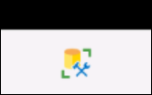

2. In the **Connect to Server** window, ensure that the **Server name** is set to **localhost**, and that the Authentication dropdown list is set to **Windows Authentication**.
	
	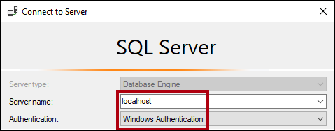

3. Select **Connect**.
	
	

4. To open a script file, on the **File** menu, select **Open** > **File**.

5. In the **Open File** window, go to the **C:\LabFiles\DP-500-Azure-Data-Analyst\Allfiles\14\Assets** folder.

6. Select the **1-Setup** sql file.

	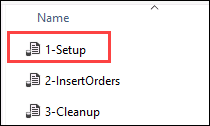

7. Select **Open**.

	

8. Review the script.

	*This script creates a table named **FactInternetSalesRealTime**. A different script will load data into this table to simulate a real-time workload of internet sales orders.*

9. To run a script, on the toolbar, select **Execute** (or press **F5**).

	

10. To close the file, on the **File** menu, select **Close**.

11. **Ctrl+O** to access the **Open File** window. Select and open the **2-InsertOrders** sql file.

	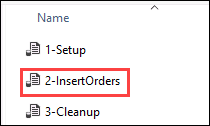

12. Review this script also.

	*This script runs an infinite loop. For each loop, it inserts a sales order and then delays for a random period of 1-15 seconds.*

13. Run the script, and leave it running until the end of the lab.

### Task 2: Set up Power BI Desktop

In this task, you will open a pre-developed Power BI Desktop solution.

1. To open File Explorer, on the taskbar, select the **File Explorer** shortcut.

	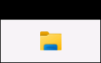

2. Go to the **C:\LabFiles\DP-500-Azure-Data-Analyst\Allfiles\14\Starter** folder.

3. To open a pre-developed Power BI Desktop file, double-click the **Internet Sales - Monitor data in real time.pbix** file.

4. To save the file, on the **File** ribbon tab, select **Save as**.

5. In the **Save As** window, go to the **C:\LabFiles\DP-500-Azure-Data-Analyst\Allfiles\14\MySolution** folder.

6. Select **Save**.

### Task 3: Review the report

In this task, you will review the pre-developed report.

1. In Power BI Desktop, review the report page.

	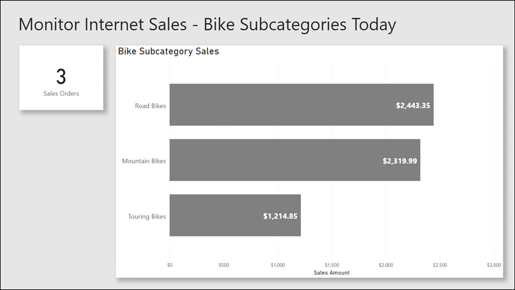

	*This report page has a title and two visuals. The card visual displays the number of sales orders, while the bar chart visual displays the sales amount for each bike subcategory.*

2. To refresh the report, on the **View** ribbon tab, from inside the **Show** panes group, select **Performance analyzer**.

	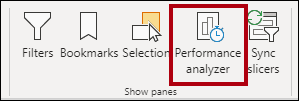

3. In the **Performance analyzer** pane (located to the right of the **Visualizations** pane), select **Start recording**.

	

	*Performance analyzer inspects and displays the duration necessary to update or refresh the visuals. Each visual issues at least one query to the source database. For more information, see [Use Performance Analyzer to examine report element performance](https://docs.microsoft.com/power-bi/create-reports/desktop-performance-analyzer).*

4. Select **Refresh visuals**.

	

5. Notice that the report visuals update to show the latest internet sales results.

	*When developing a report that connects to a local DirectQuery model, it's not possible to refresh the report by using the **Refresh** command (located on the **Home** ribbon tab). That's because Power BI Desktop refreshes the DirectQuery table connections instead. To refresh the report visuals, follow the steps you just did. When published to the Power BI service, report consumers will be able to select **Refresh** on the action bar to refresh the report visuals.*

	*When you design a report for real-time analysis, there must be a better way than asking users to constantly refresh the report page. You will achieve that better way when you set up automatic page refresh in the next exercise.*

## Set up automatic page refresh

In this exercise, you will set up automatic page refresh and experiment by using the change detection feature.

*Automatic page refresh requires at least one model table that's set to use DirectQuery storage mode.*

### Task 1: Set up automatic page refresh

In this task, you will set up automatic page refresh.

1. To select the report page, first select an empty area of the report page (below the graph).

2. In the **Visualizations** pane, select the format icon (paint brush).

	

3. Switch the **Page refresh** setting (last in the list) to **On**.

	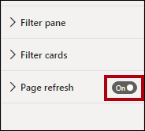

	*Automatic page refresh is a page-level setting. You can enable it for specific pages in the report.*

4. In the **Performance analyzer** pane, notice that the report visuals just refreshed.

5. In the **Visualizations** pane, expand open the **Page refresh** settings.

	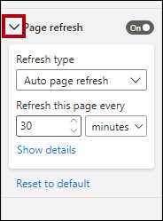

6. Notice that by default the page will refresh every 30 minutes.

7. Modify the settings to refresh the page every 5 seconds.

	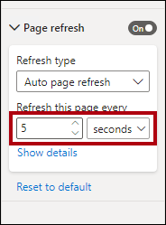

	*Important: This frequent refresh interval will help you efficiently work through this lab. But take care, because setting such a frequent refresh interval could seriously impact on the performance of the source database and other users viewing the report.*

	*Because an internet sales order loads every 1-15 seconds, sometimes the page refresh retrieves the same results (because the database recorded no orders in the last five seconds). Preferably, the report visuals only refresh when needed. You will set up the change detection feature to do that in the next task.*

	*Once published to the Power BI service, refresh intervals less than 30 minutes require that you save the report to a workspace assigned to Premium capacity. Also, a capacity admin must enable and set up the capacity to allow such frequent intervals. For more information, see [Automatic page refresh in Power BI](https://docs.microsoft.com/power-bi/create-reports/desktop-automatic-page-refresh).*

### Task 2: Set up change detection

In this task, you will set up change detection.

1. In the **Page refresh** settings, set the **Refresh type** dropdown list to **Change detection**.

	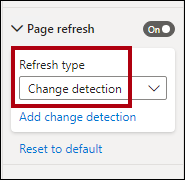

2. To create a change detection measure, select the **Add change detection** link.

	

3. In the **Change detection** window, notice that the default set up is to create a new measure.

	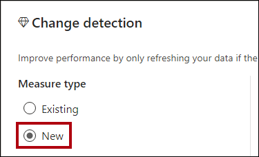

4. In the **Choose a calculation** dropdown list, select **Count (Distinct)**.

	

5. In the **Fields** pane (located at the right, inside the window), scroll down to locate the **Internet Sales** table.

6. Select the **Sales Order** field, and notice that the window added it to the **Choose a field to apply it to** box.

	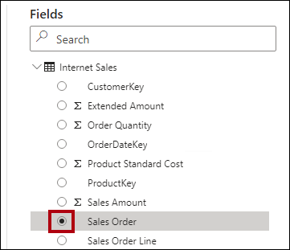

7. For the **Check for changes every** setting, set it to 5 seconds.

	

8. Select **Apply**.

	

9. In the **Fields** pane, inside the **Internet Sales** table, notice the addition of a change detection measure.

	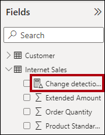

	*Power BI now uses the change detection measure to query the source database every five seconds. Each time, Power BI stores the result so it can compare it the next time it's used. When the results differ, it means the data has changed (in this case, the database inserted new internet sales orders). In this case, Power BI refreshes all report page visuals.*

	*Once published to the Power BI service, Power BI only supports change detection measures for Premium capacities.*

10. In the **Performance analyzer** pane, select **Clear**.

	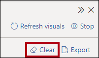

11. Notice that Performance analyzer displays change detection queries.

12. Notice that sometimes multiple change detection queries happen before Power BI Desktop refreshes the report visuals.

	*That's because the database inserted no new internet sales orders at that time. This set up is now more efficient because report visuals only refresh when necessary.*

### Finish up

In this task, you will finish up.

1. Save the Power BI Desktop file.

	

2. Close Power BI Desktop.

3. In SSMS, to stop running the script, on the toolbar, select **Stop** (or press **Alt+Break**).

	

4. Close the script file.

5. Close SSMS.

> **Note**: **Congratulations!** You have successfully completed the exercise. Please validate your progress by clicking on **(...) icon** and switch to **Lab Validation** tab and then click on **Validate** button for the respective task.
